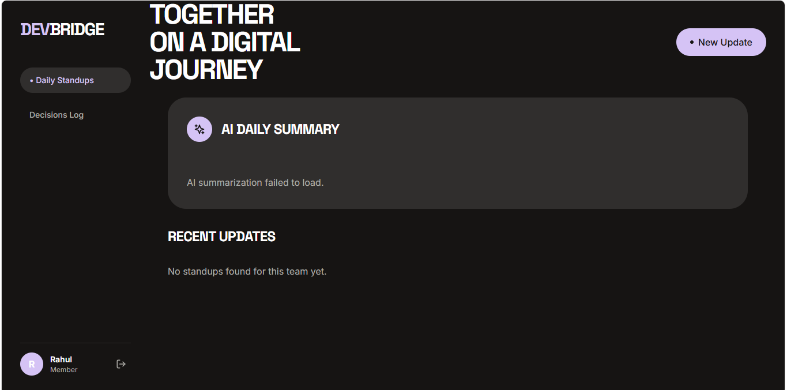
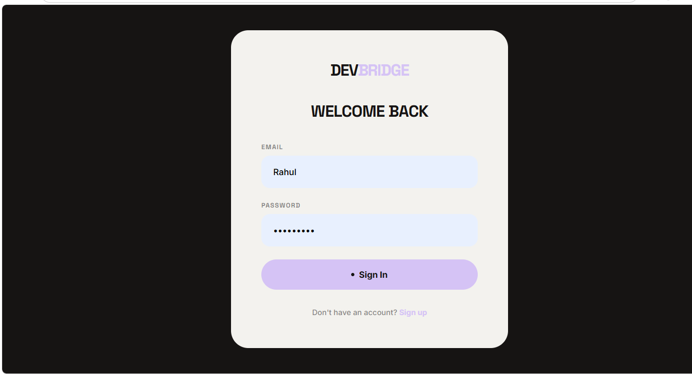
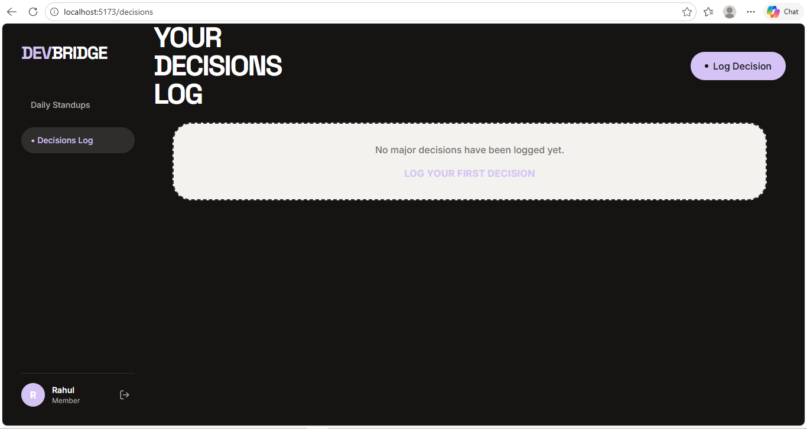

# 🌍 Global DevBridge

An aesthetic, AI-powered asynchronous collaboration platform for distributed engineering teams. Built with a modern **React (Vite) + Tailwind** frontend and a robust **Node.js (Express) + PostgreSQL (Neon)** backend, featuring a **Google Gemini** RAG pipeline.

---

## ✨ Visual Preview

| Dashboard Overview | Secure Login |
| :---: | :---: |
|  |  |

| Decisions Log |
| :---: |
|  |

---

## 🛠️ Detailed Technology Stack

### **Frontend (The UI Experience)**
- **React 18 & Vite**: For lightning-fast development and optimized production builds.
- **TypeScript**: Ensuring type safety across the entire component architecture.
- **Tailwind CSS**: Custom "Brutalist" design system using CSS variables and utility classes.
- **Lucide React**: For consistent, high-quality iconography.
- **React Router Dom**: Seamless client-side navigation between views.

### **Backend (The Engine)**
- **Node.js & Express**: High-performance API layer with layered architecture.
- **Prisma ORM**: Type-safe database access and automated migrations.
- **JWT (JsonWebToken)**: Secure, stateless authentication and authorization.
- **Bcrypt**: Industry-standard password hashing.

### **AI & Data (The Intelligence)**
- **Google Gemini**: Advanced LLM for intelligent RAG (Retrieval-Augmented Generation).
- **LangChain.js**: Orchestrating the AI pipeline for summarizing developer updates.
- **Neon PostgreSQL**: Serverless database for instant scalability and high availability.

---

## 🔮 Future Scope: Empowering Developers

Global DevBridge is designed to solve the "Standup Fatigue" in distributed teams. Here is how we plan to expand the value for daily work:

- **🤖 Automated Jira/GitHub Integration**: Automatically pull your "Did Today" status from your actual Git commits and Jira tickets.
- **📊 Team Sentiment Analysis**: Use AI to detect if team morale is dropping or if a particular service is causing high developer frustration.
- **💬 Real-time Collaborative Brainstorming**: A shared space for real-time decision-making with AI acting as a technical moderator.
- **📱 Mobile Companion App**: Submit your standup on the go with voice-to-text integration.
- **🧩 VS Code Extension**: Log your daily updates and architectural decisions without ever leaving your IDE.

---

## 🚀 Setup & Installation

### 1. Database Setup (Neon.tech)
1. Create a free account at [Neon.tech](https://neon.tech/).
2. Create a new project and copy your **Postgres Connection URI**.
3. Create a `.env` file in the `backend` folder and add:
   ```env
   DATABASE_URL="your_neon_connection_string"
   ```

### 2. Backend Setup
```bash
cd backend
npm install

# Setup AI and Security
# Add your Google Gemini API Key and a JWT Secret to backend/.env
# GEMINI_API_KEY="your_google_key"
# JWT_SECRET="your_random_string"

# Push schema and generate client
npx prisma db push
npx prisma generate

# Start development
npm run dev
```
*Backend runs on `http://localhost:5000`*

### 3. Frontend Setup
```bash
cd frontend
npm install

# Start development
npm run dev
```
*Frontend runs on `http://localhost:5173`*

---

## 🧠 Key Features
- **Modern Aesthetic**: Ultra-clean, brutalist UI inspired by high-end design agencies.
- **AI Summaries**: Uses Gemini to analyze team progress and identify blockers automatically.
- **Decision Tracking**: A dedicated log for tracking architectural and product decisions.
- **Global Reach**: Designed for remote, distributed teams working across timezones.
